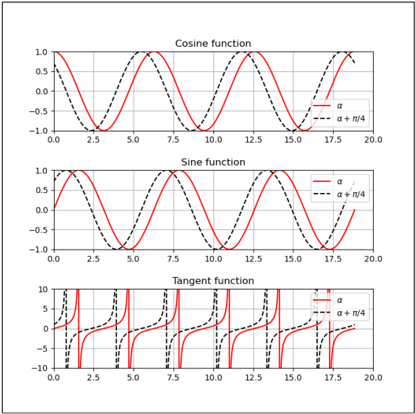
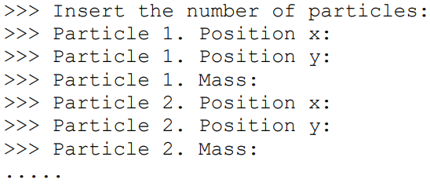
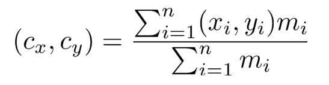
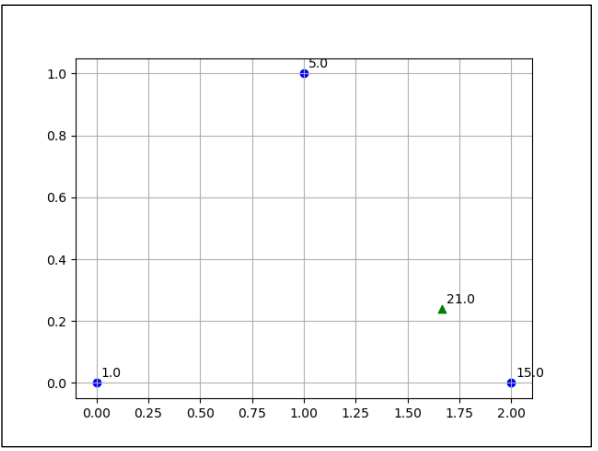
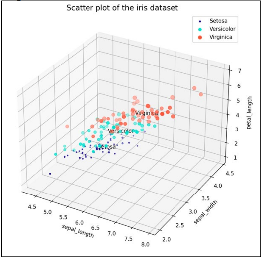
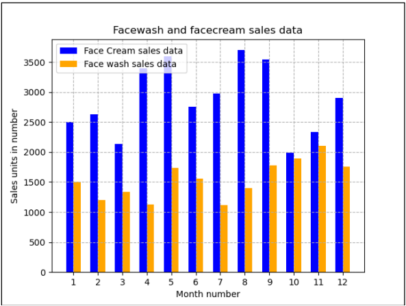

# Laboratorio 4

En este laboratorio se abordan los siguientes ejercicios:

## [Ejercicio 1](./exercise1/Lab4_1.py): Manipulación de Datos con Pandas
Crea un conjunto de datos que contenga información sobre 5 estudiantes, incluyendo sus nombres, edades y puntajes de prueba (0-100). Guarda los datos en un archivo CSV, luego tu tarea es cargar estos datos en un DataFrame de pandas y realizar varias operaciones para analizar y manipular los datos.

- **Carga de Datos**: Carga el archivo CSV proporcionado, "student_data.csv", en un DataFrame de pandas. El archivo CSV contiene las columnas: Nombre, Edad y Puntaje.
- **Exploración Básica**:
  - Muestra las primeras 5 filas del DataFrame para inspeccionar los datos.
  - Imprime los tipos de datos de cada columna.
  - Verifica si hay valores faltantes en el DataFrame.
- **Análisis Estadístico**: Calcula y muestra la media y la mediana de los puntajes de prueba.
- **Filtrado de Datos**: Crea un nuevo DataFrame que contenga solo las filas donde la edad es mayor que 20.
- **Agrupación y Agregación**: Agrupa los datos por edad y calcula el puntaje promedio para cada grupo de edad.
- **Exportación de Datos**: Guarda el DataFrame filtrado (del paso 4) en un nuevo archivo CSV llamado "filtered_student_data.csv".

### Instrucciones de Ejecución
Para ejecutar el programa, sigue estos pasos:
1. Abre una terminal.
2. Navega hasta la carpeta del Laboratorio 4.
3. Ejecuta el archivo `Lab4_1.py` utilizando el intérprete de Python.

## [Ejercicio 2](./exercise2/Lab4_2.py): Gráficos Trigonométricos

Crea tres gráficos en una Figura. En cada uno de esos tres gráficos se representan las relaciones trigonométricas del ángulo 〈 y (〈 + π/4). Un gráfico será continuo en rojo y el otro discontinuo en negro. Etiqueta cada uno de ellos apropiadamente.

El resultado tiene que ser identico al siguiente:

### Instrucciones de Ejecución
Para ejecutar el programa, sigue estos pasos:
1. Abre una terminal.
2. Navega hasta la carpeta del Laboratorio 4.
3. Ejecuta el archivo `Lab4_2.py` utilizando el intérprete de Python.

## [Ejercicio 3](./exercise3/Lab4_3.py): Centro de Masa de Partículas

Crea un programa que calcule el centro de masa de un conjunto de partículas introducido por el usuario en un sistema bidimensional.

- Solicita al usuario en la pantalla el número de partículas que estarán en el sistema.
- Solicita al usuario en la pantalla las coordenadas y la masa de cada partícula de la siguiente manera:
  
- Calcula las coordenadas del centro de masa utilizando la ecuación proporcionada:
  
- Grafica cada partícula en su posición correspondiente, escribiendo su masa junto a la partícula. Además, dibuja el centro de masa del sistema de partículas en la posición calculada utilizando la ecuación, asignándole la masa de todo el sistema.
  
El resultado tiene que ser similar al siguiente:

### Instrucciones de Ejecución
Para ejecutar el programa, sigue estos pasos:
1. Abre una terminal.
2. Navega hasta la carpeta del Laboratorio 4.
3. Ejecuta el archivo `Lab4_3.py` utilizando el intérprete de Python.

## [Ejercicio 4](./exercise4/Lab4_4.py): Gráfico de Dispersión 3D del Conjunto de Datos Iris

Haz un gráfico de dispersión 3D del conjunto de datos iris, proporcionado en el archivo iris.csv. Cada fila del CSV proporciona la información de una flor. Cada flor se describe mediante 4 características (longitud del sépalo, ancho del sépalo, longitud del pétalo y ancho del pétalo), cuyos nombres se escriben en la primera fila del CSV.

El resultado final tiene que ser algo parecido a:

### Instrucciones de Ejecución
Para ejecutar el programa, sigue estos pasos:
1. Abre una terminal.
2. Navega hasta la carpeta del Laboratorio 4.
3. Ejecuta el archivo `Lab4_4.py` utilizando el intérprete de Python.

## [Ejercicio 5](./exercise5/Lab4_5.py): Gráfico de Barras de Ventas de Productos

Utiliza el archivo company_sales_data.csv. Este archivo contiene las ventas de diferentes productos a lo largo de todo el año. Lee el archivo como un DataFrame de pandas y traza un gráfico de barras que muestre tanto la crema facial como el lavado facial durante todos los meses del año.

El resultado final tiene que ser algo parecido a:

### Instrucciones de Ejecución
Para ejecutar el programa, sigue estos pasos:
1. Abre una terminal.
2. Navega hasta la carpeta del Laboratorio 4.
3. Ejecuta el archivo `Lab4_5.py` utilizando el intérprete de Python.

---
Este README.md proporciona una guía completa para entender y ejecutar las operaciones requeridas en el Laboratorio 4. Cada sección describe detalladamente las operaciones a realizar y cómo ejecutar el código asociado a cada una.
